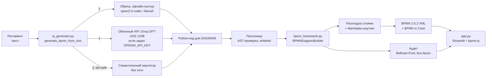

# ⚡ Архитектор BPMN-диаграмм — ПАО «Интер РАО»

**Регламент на русском языке → валидный BPMN 2.0.2 → аудит бизнес-архитектуры. За секунды, без ручной доводки.**

**🌐 Живое демо:** https://arkhitektor-bpmn-diagramm-aefqyewayke8vtx5fxsryn.streamlit.app — генерация через Groq GPT-OSS 120B за ~3–5 с.

Решение для трека «Архитектор BPMN-диаграмм» хакатона «ИИ-ассистенты для энергетики».
Заказчик — Дирекция бизнес-архитектуры ПАО «Интер РАО».

- Диаграмма открывается и редактируется на [demo.bpmn.io](https://demo.bpmn.io) без ошибок и предупреждений.
- Это не «карта токийского метро»: сложные этапы уходят в раскрытые подпроцессы, все стрелки ортогональные (90°), блоки и подписи не пересекаются.
- Вместе с диаграммой считается аудит процесса: bus-factor, критический путь SLA, циклы возврата, тупики.
- Работает без интернета и без LLM: если нейросеть недоступна, включается встроенный семантический эмулятор.
- Регламент можно загрузить из файла **DOCX / PDF / TXT** (очистка колонтитулов). Обратная выгрузка — **Паспорт процесса** (Markdown: RACI, операционный регламент, ИТ-ландшафт, карта рисков).

---

## 🚀 Запуск за одну минуту

```bash
python3 -m venv .venv && source .venv/bin/activate
pip install -r requirements.txt
streamlit run app.py
```

Откроется `http://localhost:8501`. Первый пример генерируется автоматически.

Проверка без веб-интерфейса:

```bash
python3 test_pipeline.py                  # демо-сценарий -> demo_process.bpmn + аудит в консоли
python3 build_examples.py                 # пересборка examples/*.bpmn и *.audit.json
python3 validate_bpmn.py demo_process.bpmn examples/*.bpmn   # строгая офлайн-проверка, код 0 = OK
python3 mcp_server.py                     # MCP-сервер для корпоративных агентов (JSON-RPC, stdio)
python3 stress_test.py                    # «кривые» регламенты из stress_tests/ -> stress_tests/out/report.md
python3 stress_test.py --llm              # то же через LLM
```

---

## ☁️ Развёртывание (Streamlit Community Cloud)

1. Зеркало репозитория на GitHub (Streamlit Cloud подключается только к GitHub).
2. https://share.streamlit.io → **Create app** → репозиторий, ветка `main`, файл `app.py`;
   в **Advanced settings** выбрать Python **3.12**.
3. **Secrets**: вставить содержимое `.streamlit/secrets.toml.example` с ключом Groq
   (бесплатно: https://console.groq.com/keys) и запасным ключом OpenRouter (https://openrouter.ai/settings/keys,
   строки `FALLBACK_*` без `#`). Без ключей сервис работает на эмуляторе.
4. **Deploy** → постоянная ссылка вида `https://<имя>.streamlit.app`.

Ollama в облаке недоступна: приложение за ~1,5 с понимает это и переходит к API или эмулятору.
Установка проверена с нуля на Python 3.10, 3.12 и 3.14 (`pip install -r requirements.txt`).

---

## 🧭 Инструкция для жюри (3 шага)

1. `streamlit run app.py`. Слева выберите один из трёх готовых регламентов, вставьте свой текст **или загрузите файл .docx / .pdf / .txt**.
2. Нажмите **«🚀 Сгенерировать BPMN 2.0»**. Справа появится интерактивная диаграмма (перетаскивание — панорама, `Ctrl` + колесо или кнопки ＋/－ — масштаб). Переключатель над диаграммой: **«Раздельный вид»** (регламент слева, диаграмма справа) или **«Широкий вид»** (диаграмма на всю ширину, регламент в аккордеоне «Регламент и настройки»). Кнопка **«⛶ Панорама на весь экран»** работает в обоих режимах: остаётся только холст на весь монитор (колесо — зум, мышь — перемещение), выход по `Esc` или кнопкой «✕ Закрыть панораму».
3. Скачайте результат: **«⬇️ Скачать .bpmn»** (откройте на https://demo.bpmn.io), **«⬇️ Скачать .svg»** — векторная картинка, **«⬇️ Скачать Паспорт (.md)»** — официальный паспорт процесса и операционный регламент. Ниже диаграммы — дашборд **«Аудит бизнес-архитектуры»**, включая блок **«ИТ-ландшафт и документооборот процесса»**.

Готовые файлы лежат в `examples/`: `.txt` (исходный регламент), `.bpmn` (результат) и `.audit.json` (аудит).

В сайдбаре слева — **«💬 AI-Ассистент Бизнес-Архитектора»**. Чипы быстрых вопросов: разбор SLA, ускорение процесса, должностная инструкция для исполнителя, предложение следующего шага. Команды вроде «Добавь согласование с экологами после шага 3» меняют регламент и сразу перестраивают диаграмму (уведомление «✨ Диаграмма обновлена ассистентом в диалоге»).

---

## 🏗 Архитектура



| Файл | Роль |
| --- | --- |
| `bpmn_framework.py` | Ядро: API песочницы `DIAGRAM.*`, раскладка, роутинг, XML, аудит, самовосстановление |
| `ai_generator.py` | `generate_bpmn_from_text`, `execute_generated_code`, `assistant_chat`, `generate_process_passport` (паспорт процесса), клиенты LLM, эмулятор |
| `app.py` | Веб-интерфейс (Streamlit): bpmn-js, аудит, сайдбар «💬 AI-Ассистент Бизнес-Архитектора» |
| `mcp_server.py` | MCP-сервер (JSON-RPC 2.0, stdio): `generate_bpmn`, `analyze_process_bottlenecks`, `get_process_it_landscape` |
| `examples/` | Три регламента и результаты генерации |
| `validate_bpmn.py` | Независимый строгий валидатор выходных файлов |
| `build_examples.py`, `test_pipeline.py` | Пересборка примеров и демо-сценарий |
| `assets/` | bpmn-js 17.11.1 (локальная копия для работы без интернета) |

### Контракт API песочницы жюри

Сигнатуры сохранены без изменений:

```python
pool_id, lane_ids = DIAGRAM.add_pool(parent_id, ["Диспетчер", "Начальник смены"])
DIAGRAM.add_task(name, parent_id)  # так же add_user_task и add_script_task
DIAGRAM.create_subprocess(name, parent_id)
DIAGRAM.add_exclusive_gateway(name, parent_id)  # так же add_parallel_gateway и add_inclusive_gateway
DIAGRAM.add_group(name, parent_id)
DIAGRAM.add_link(source_id, target_id, condition_name="")
```

---

## 🧩 Как мы избегаем «карты метро»

| Приём | Что делает |
| --- | --- |
| Строгая декомпозиция | Если у одного подразделения больше 3 шагов подряд, они сворачиваются в `create_subprocess` (раскрытый, с внутренними Начало и Завершено) |
| Дорожки | `add_pool` с ролями: каждая задача лежит в дорожке своего исполнителя |
| Слоистая раскладка | DFS находит обратные рёбра, затем строятся слои по длиннейшему пути: колонки задают X, дорожки задают Y |
| Ортогональный роутинг | Перебор путей (прямой, Z, L, U, обход) с штрафами за изгибы, наложения и пересечения с блоками |
| Подписи | Условия на шлюзах ставятся кандидатным поиском вне узлов, линий и других подписей, на 12 px выше стрелки |
| Широкие подпроцессы | Увеличенные внутренние отступы, чтобы стрелки внутри подпроцесса не прижимались к границе |
| Единый финал | Все ветки смыкаются в `ROOT_END_TASK_ID` |

**BPMN in Color** (`bioc` и `color`, стандартные неймспейсы bpmn.io и OMG):

| Элемент | Контур / заливка |
| --- | --- |
| Начало | `#2E7D32` / `#E8F5E9` |
| Конец | `#C62828` / `#FFEBEE` |
| Задачи (`task`, `userTask`, `scriptTask`) | `#1565C0` / `#E3F2FD` |
| Шлюзы (XOR, AND, OR) | `#F57F17` / `#FFF8E1` |
| Подпроцесс | `#4527A0` / `#EDE7F6` |
| Возвратные (rework) стрелки | красные `#C62828` |

Чистота XML:

- У фигуры `exclusiveGateway` в DI стоит `isMarkerVisible="true"` (маркер X на ромбе); у `parallelGateway` и `inclusiveGateway` атрибут не ставится.
- Тег `<bpmn:group>` не попадает в `<bpmn:process>`: группа размещена в `<bpmn:collaboration>` с `category` / `categoryValue`, это валидно по схеме BPMN 2.0.2.
- Каждый элемент модели имеет пару в `bpmndi`.

---

## 📊 Аудит бизнес-архитектуры

Считается на графе процесса, а не «на глаз»:

| Карточка | Как считается |
| --- | --- |
| **Bus-factor** | Доля атомарных задач у одной роли (учитывается содержимое подпроцессов). Порог — **45%**: выше него процесс держится на одном подразделении |
| **Критический путь (SLA)** | Самый длинный путь по часам алгоритмом **Беллмана — Форда** (веса `−часы`) с восстановлением маршрута; подпроцесс весит как его внутренний критический путь. Сравнивается с целевым сроком |
| **Циклы возврата** | Обратные рёбра: список, время каждого цикла и рост срока при худшем возврате |
| **Тупики и сироты** | Узлы без выхода или входа; автоматически подключаются, действие фиксируется в отчёте |
| **ИТ-ландшафт и документооборот** | Из текста регламента извлекаются ИТ-системы (АСУ ТП / SCADA, оперативный журнал, CRM, электронная площадка, биллинг, 1С / SAP / ERP, СЭД) и документы (наряд-допуск, дефектная ведомость, технические условия, договор, заявка, акт и др.) с номерами шагов и ролями. В аудите: ключи `it_systems` и `artifacts`; в интерфейсе — синие 💻 и зелёные 📄 плашки. Работает для любого движка (LLM и эмулятор) |
| **Рекомендации** | Автоматически по найденным рискам: перераспределить задачи, ввести параллельность, ужесточить входной контроль |

### Три готовых кейса

| Пример | Что показывает |
| --- | --- |
| `example_1_substation_repair` | Аварийный ремонт на ПС 110 кВ, наряд-допуск, служба безопасности. Целевой срок — 12 ч |
| `example_2_equipment_procurement` | Закупка силового трансформатора: проверка СБ, тендер, повторные торги. Возврат заметно выбивается из SLA |
| `example_3_grid_connection` | Технологическое присоединение льготного потребителя, замечания к ТУ |

---

## 🛡 Отказоустойчивость

Цепочка `generate_bpmn_from_text` никогда не бросает исключение:

1. **Облачная модель по OpenAI-совместимому API** — если задан `OPENAI_API_KEY`. Основной режим демо:
   Groq, GPT-OSS 120B (ответ за секунды); запасные по порядку — Cerebras (та же gpt-oss-120b) и OpenRouter (qwen3.8-27b), `FALLBACK_*`, `FALLBACK2_*`.
2. **Ollama** (`http://localhost:11434/api/generate`) — офлайн-режим для закрытого контура, модель выбирается
   автоматически: `qwen2.5-coder`, затем `llama3`. На ноутбуке 7B-модель отвечает 2–4 минуты.
3. **Встроенный эмулятор** — разбор нумерованных шагов, ролей, условий («Если … — перейти к п.N, иначе …»), «Параллельно:» и этапов. Сам генерирует код для `DIAGRAM`.

Защита от плохого ответа модели:

- **Контроль качества графа** до самовосстановления: задача с несколькими выходами без шлюза, шлюз без ветвления,
  узел без входа, ссылка на несуществующий id — ответ отклоняется, модель получает список ошибок и одну попытку
  исправиться; иначе включается эмулятор. Причина видна прямо под кнопкой генерации и в «Трассе выбора движка».
- **Нормализация текста** (`normalize_regulation`): колонтитулы PDF («Стр. 5 из 17»), переносы слов,
  разорванные ссылки «п.\n3.2.5», многоуровневая нумерация «3.2.1.» → сквозная «1.» вместе со ссылками.

- Код перед запуском проходит AST-проверку в песочнице: запрещены `import`, `open`, `eval`, `exec`, dunder-атрибуты и циклы `while`.
- Разрешены только методы `DIAGRAM` и безопасные builtins.
- Ответ LLM в markdown-обёртке очищается. Если код невалиден или падает, включается эмулятор, а причина попадает в «Трассу выбора движка».
- Самовосстановление графа: несуществующие id не роняют сборку (`skipped_links`), дубли и самопетли отбрасываются, межуровневые связи поднимаются до подпроцесса, тупики и «сироты» подключаются к финалу и старту.

Переменные окружения (все необязательны):

| Переменная | Значение по умолчанию |
| --- | --- |
| `OLLAMA_URL` | `http://localhost:11434` |
| `OLLAMA_MODEL` | автовыбор `qwen2.5-coder` → `llama3` |
| `OLLAMA_TIMEOUT` | `300` — таймаут запроса, секунды (7B на MacBook M2 ≈ 5 ток/с, схема ≈ 3–4 мин) |
| `OLLAMA_NUM_CTX` | `8192` — окно контекста (промпт ≈ 1800 токенов + ответ до 3500) |
| `LLM_MAX_ATTEMPTS` | `2` — попыток на движок: при ошибках структуры модель получает их список и исправляет код |
| `LLM_RETRY_MAX_CALL_S` | `90` — повтор не делается, если первый ответ шёл дольше (иначе ожидание удваивается) |
| `OPENAI_API_KEY` | если задан, подключается внешний API |
| `OPENAI_BASE_URL`, `OPENAI_MODEL` | адрес и модель совместимого API (Groq: `openai/gpt-oss-120b`) |
| `FALLBACK_*`, `FALLBACK2_*`, `FALLBACK3_*` (`_API_KEY`, `_BASE_URL`, `_MODEL`) | запасные OpenAI-совместимые провайдеры с открытыми моделями по порядку (Cerebras, OpenRouter), если основной отказал |
| `OPENAI_REASONING_EFFORT`, `FALLBACK_REASONING_EFFORT` | для рассуждающих моделей: `low` — быстрее и экономнее по лимиту токенов; `none` для OpenRouter — без «размышлений» |
| `BPMN_AI_MODE=emulator` | принудительно использовать только эмулятор |

---

## 💬 Диалоговый AI-ассистент

Сайдбар **«💬 AI-Ассистент Бизнес-Архитектора»** работает над активным процессом (задачи, роли, SLA, bus-factor, циклы возврата, ИТ-системы). Три режима:

| Режим | Что делает | Пример |
| --- | --- | --- |
| Аналитика | Объясняет узкие места по цифрам аудита, не выдумывает факты | «В чём причина срыва SLA?», «Как разгрузить диспетчера?» |
| Правка на лету | Меняет текст регламента и **перестраивает диаграмму** через `execute_generated_code` | «Добавь согласование с экологами после шага 3», «Сделай шаги 4 и 5 параллельными» |
| Реверс-генерация | Собирает пошаговую должностную инструкцию роли **из BPMN XML** (дорожки, потоки, условия) | «Составь инструкцию для Диспетчера» |

Цепочка та же, что у генерации: облако (Groq / OpenAI-совместимый API) → Ollama → локальные эвристики без сети. История — `st.session_state["chat_messages"]`. Если ассистент изменил схему, холст bpmn-js и плашки аудита обновляются, появляется уведомление «✨ Диаграмма обновлена ассистентом в диалоге». API: `assistant_chat(message, history, current_xml, current_audit, current_text)`.

---

## 🔌 MCP — интеграция в корпоративных ИИ-агентов

Сервер `mcp_server.py` говорит на JSON-RPC 2.0 по Model Context Protocol (stdio, 2024-11-05). Его можно подключить к Cursor, Claude Desktop или внутреннему агенту Интер РАО — без HTTP-обвязки.

```bash
python3 mcp_server.py
```

| Инструмент | Вход | Выход |
| --- | --- | --- |
| `generate_bpmn` | `regulation_text`, опционально `use_llm` | BPMN 2.0 XML + Audit JSON |
| `analyze_process_bottlenecks` | текст регламента **или** код `DIAGRAM.*` | SLA, bus-factor, циклы, риски, рекомендации |
| `get_process_it_landscape` | `regulation_text` | ИТ-системы и документы с шагами и ролями |

Пример кадра: `{"jsonrpc":"2.0","id":1,"method":"tools/call","params":{"name":"generate_bpmn","arguments":{"regulation_text":"…","use_llm":false}}}`

---

## 📄 Загрузка регламентов и Паспорт процесса

**Прямая загрузка.** В панели ввода — `st.file_uploader` для `.docx`, `.pdf`, `.txt`. Текст извлекается безопасно (utf-8 / cp1251, python-docx, pypdf); если библиотеки нет, показывается инструкция `pip install`. Извлечённый текст проходит `normalize_regulation()` (колонтитулы PDF, разорванные ссылки, многоуровневая нумерация). **State Guard:** файл обрабатывается только если `uploaded_file.name != last_uploaded_filename` — повторный прогон Streamlit не затирает правки в поле. Селектор переключается на «✍️ Свой текст регламента», бейдж показывает имя файла и число символов.

**Паспорт процесса.** `generate_process_passport(xml, audit, text)` собирает Markdown:

1. Паспорт: наименование, целевой SLA, владелец, метрики (узлы, подпроцессы, роли).
2. Матрица RACI: роль, число задач, доля нагрузки, статус bus-factor.
3. Пошаговый операционный регламент: номер, исполнитель, действие, срок, документы, ИТ-системы, условия переходов.
4. ИТ-ландшафт: реестры систем (АСУ ТП, CRM, 1С, …) и документов (наряд-допуск, ТУ, акты, …).
5. Карта рисков: критический путь Беллмана — Форда, стоимость циклов возврата, рекомендации.

Скачивается кнопкой **«⬇️ Скачать Паспорт (.md)»** как `{file_stem}_passport.md`. Все поля аудита читаются через `.get()` — пустой аудит не роняет выгрузку.

---

## 💼 Бизнес-ценность

- **Скорость:** регламент на 2 страницы превращается в модель за секунды вместо дней ручного моделирования.
- **Единый стиль:** все процессы Компании выглядят одинаково (цвета, дорожки, декомпозиция), а значит их проще согласовывать и поддерживать.
- **Аудит из коробки:** узкие места и зависимость от одного подразделения видны до внедрения регламента, а не после сбоя.
- **Безопасность для ИТ-контура:** локальный запуск (Ollama), без отправки регламентов вовне; при недоступной LLM система деградирует мягко.
- **Ассистент в чате:** регламент правится командой на естественном языке, диаграмма и аудит пересчитываются сразу; должностная инструкция роли собирается из BPMN, а не «из головы».
- **MCP:** те же генерация, аудит и ландшафт доступны корпоративным агентам как инструменты, без копирования XML вручную.
- **Паспорт процесса:** обратная выгрузка из BPMN+аудита в согласуемый Markdown (RACI, регламент, ИТ-ландшафт, риски) — без ручной сборки в Word.

## 📋 Возможности и ограничения

### Что умеет

| Возможность | Как реализовано |
| --- | --- |
| Текст регламента → BPMN 2.0 XML | LLM пишет Python-код для API `DIAGRAM.*`, движок строит модель, раскладку и `BPMNDI` |
| Участники | Пул процесса с дорожками по ролям; каждая задача — в дорожке исполнителя |
| Ветвления | Exclusive (XOR) с подписанными условиями, parallel (AND) разветвление/слияние, inclusive (OR) |
| Возвраты на доработку | Обратные стрелки (красные), подпись под линией обхода |
| Декомпозиция | Больше 3 шагов одной роли подряд → раскрытый подпроцесс со своими «Начало/Завершено» |
| Валидность | Каждый файл проверяется по официальной XSD BPMN 2.0 (OMG) перед выдачей; открывается и редактируется в bpmn.io |
| Читаемость | Ортогональные стрелки, без наложений блоков и подписей (`validate_bpmn.py`), высота задачи под текст |
| Кривой ввод | Текст из PDF (колонтитулы, переносы, нумерация «3.2.1»), опечатки, сплошной текст без нумерации |
| Отказоустойчивость | Groq → Cerebras → OpenRouter → Ollama → встроенный эмулятор; мусорный ввод — понятная ошибка |
| Аудит | Bus-factor, критический путь SLA (Беллман — Форд), циклы возврата, ИТ-системы и документы |
| Экспорт | `.bpmn` (XML) и `.svg` (картинка для документов) |
| Интеграция | MCP-сервер для корпоративных ИИ-агентов, диалоговый ассистент с правкой схемы |

### Результаты на реальной модели

Прогон `python3 stress_test.py --llm --pause 25 examples/*.txt stress_tests/*.txt` через Groq `openai/gpt-oss-120b`:

| Вход | Результат | Время |
| --- | --- | --- |
| 3 отраслевых регламента (`examples/`) | ✅ схему построила модель | 4–9 с |
| Сплошной текст без нумерации | ✅ роли определены верно | 3 с |
| Текст из PDF с колонтитулами и нумерацией 3.2.1 | ✅ | 3 с |
| Опечатки, строчные буквы | ✅ | 3 с |
| Параллельные работы + повторная проверка | ✅ | 4 с |
| Длинный регламент (40 шагов) | ✅ 43 узла | 6 с |
| Текст на английском | ✅ 3 роли | 2 с |
| Мусорный ввод | ✅ «Регламент не распознан», схема не выдумывается | 2 с |

Запасная модель (OpenRouter `qwen/qwen3.8-27b:free`, при «недоступном» Groq): 3/3 примера с первой попытки, 16–19 с.
Все результаты прошли XSD и `validate_bpmn.py` без замечаний.

### Ограничения

| Ограничение | Причина / что с этим делать |
| --- | --- |
| Один пул, без message flow между организациями | Контракт API `DIAGRAM.*` задаёт один процесс с дорожками; внешние стороны — отдельными дорожками |
| Нет событий-таймеров, граничных событий, сообщений | Не входят в контракт API; сроки учитываются в аудите SLA, а не в нотации |
| Системы и документы — в аналитике, не на диаграмме | Выводятся блоком «ИТ-ландшафт и документооборот», чтобы не загромождать схему data object'ами |
| Бесплатный тариф Groq: ~8 тыс. токенов/мин | ≈ 1 схема за 20–30 с; при превышении система ждёт и повторяет запрос, затем — запасной провайдер |
| Groq иногда отклоняет запросы с серверов Streamlit (HTTP 403) | Автоматически включается Cerebras (та же модель), затем OpenRouter (16–19 с) |
| Бесплатный канал OpenRouter бывает перегружен | Тогда схему строит встроенный эмулятор |
| Эмулятор (без LLM) рассчитан на нумерованные шаги | Сплошной текст и английский разбирает хуже: роли могут определяться неточно |
| Локальная модель 7B (Ollama) на ноутбуке — 2–4 мин | Офлайн-режим для закрытого контура; качество графа у 7B заметно ниже, поэтому ответы проходят отбраковку |
| bpmn.io игнорирует стиль подписей из XML | Крупные заголовки подпроцессов видны на сайте и в системах, поддерживающих `BPMNLabelStyle` |
| Подписи дорожек вертикальные | Стандартное оформление горизонтальных пулов BPMN; bpmn.io иначе не рисует |
| Диаграмма не исполняемая | По условию задачи: результат — валидная XML-модель для Системы моделирования корпоративной архитектуры |

### О моделях и правилах хакатона

- Слово «openai» в `OPENAI_API_KEY` / `OPENAI_BASE_URL` — это **название формата API** (OpenAI-совместимый протокол),
  который поддерживают Groq, OpenRouter, Ollama и облако партнёра. К сервисам OpenAI решение не обращается.
- `openai/gpt-oss-120b` — **open-source модель** (веса открыты, лицензия Apache 2.0), запускается у Groq на бесплатном тарифе.
  Запасная `qwen3.8-27b` и офлайн `qwen2.5-coder` — тоже открытые. Проприетарные модели (ChatGPT, Gemini) не используются.
- На финале — стек технологического партнёра: меняются только `OPENAI_BASE_URL`, `OPENAI_MODEL`, `OPENAI_API_KEY`.

---

## ✅ Проверено

- **Официальная XSD-схема BPMN 2.0 (OMG, `schemas/BPMN20.xsd`)**: каждый сгенерированный файл проверяется
  перед выдачей пользователю (отметка «✓ XSD BPMN 2.0» под кнопкой); невалидный XML не отдаётся.
  Отдельно: `python3 validate_bpmn.py file.bpmn`.
- **Модели — только open-source** (правила хакатона): `openai/gpt-oss-120b` (Apache 2.0) через Groq, офлайн —
  `qwen2.5-coder` в Ollama. Переход на стек партнёра (Yandex Cloud) — смена `OPENAI_BASE_URL`/`OPENAI_MODEL`.

- Все `.bpmn` (демо и три примера) импортируются в bpmn-js 17.11.1 без предупреждений.
- `validate_bpmn.py`: 0 диагональных сегментов, 0 наложений блоков, 0 пересечений чужих блоков стрелками, 0 коллизий подписей.
- Headless-прогон Streamlit (`AppTest`) для примеров и свободного текста с неизвестными ролями проходит без исключений.
- Боевая модель: 10 текстов через Groq `gpt-oss-120b` и 3 через запасную OpenRouter `qwen3.8-27b:free` (см. «Результаты на реальной модели»); Ollama `qwen2.5-coder:7b` — на MacBook Air M2.
