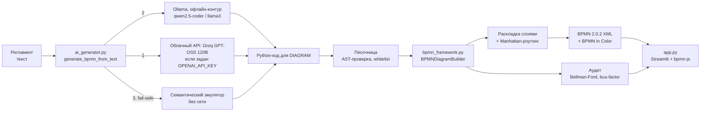

# ⚡ Архитектор BPMN-диаграмм — ПАО «Интер РАО»

**Регламент на русском языке → валидный BPMN 2.0.2 → аудит бизнес-архитектуры. За секунды, без ручной доводки.**

**🌐 Живое демо:** https://arkhitektor-bpmn-diagramm-aefqyewayke8vtx5fxsryn.streamlit.app — генерация через Groq GPT-OSS 120B за ~3–5 с.

Решение для трека «Архитектор BPMN-диаграмм» хакатона «ИИ-ассистенты для энергетики».
Заказчик — Дирекция бизнес-архитектуры ПАО «Интер РАО».

- Диаграмма открывается и редактируется на [demo.bpmn.io](https://demo.bpmn.io) без ошибок и предупреждений.
- Это не «карта токийского метро»: сложные этапы уходят в раскрытые подпроцессы, все стрелки ортогональные (90°), блоки и подписи не пересекаются.
- Вместе с диаграммой считается аудит процесса: bus-factor, критический путь SLA, циклы возврата, тупики.
- Работает без интернета и без LLM: если нейросеть недоступна, включается встроенный семантический эмулятор.

---

## 🚀 Запуск за одну минуту

```bash
python3 -m venv .venv && source .venv/bin/activate
pip install -r requirements.txt
streamlit run app.py
```

Откроется `http://localhost:8501`. Первый пример генерируется автоматически.

Проверка без веб-интерфейса:

```bash
python3 test_pipeline.py                  # демо-сценарий -> demo_process.bpmn + аудит в консоли
python3 build_examples.py                 # пересборка examples/*.bpmn и *.audit.json
python3 validate_bpmn.py demo_process.bpmn examples/*.bpmn   # строгая офлайн-проверка, код 0 = OK
python3 stress_test.py                    # «кривые» регламенты из stress_tests/ -> stress_tests/out/report.md
python3 stress_test.py --llm              # то же через LLM
```

---

## ☁️ Развёртывание (Streamlit Community Cloud)

1. Зеркало репозитория на GitHub (Streamlit Cloud подключается только к GitHub).
2. https://share.streamlit.io → **Create app** → репозиторий, ветка `main`, файл `app.py`;
   в **Advanced settings** выбрать Python **3.12**.
3. **Secrets**: вставить содержимое `.streamlit/secrets.toml.example` с ключом Groq
   (бесплатно: https://console.groq.com/keys). Без ключа сервис работает на эмуляторе.
4. **Deploy** → постоянная ссылка вида `https://<имя>.streamlit.app`.

Ollama в облаке недоступна: приложение за ~1,5 с понимает это и переходит к API или эмулятору.
Установка проверена с нуля на Python 3.10, 3.12 и 3.14 (`pip install -r requirements.txt`).

---

## 🧭 Инструкция для жюри (3 шага)

1. `streamlit run app.py`. Слева выберите один из трёх готовых регламентов или вставьте свой текст.
2. Нажмите **«🚀 Сгенерировать BPMN 2.0»**. Справа появится интерактивная диаграмма (перетаскивание — панорама, `Ctrl` + колесо или кнопки ＋/－ — масштаб).
3. Нажмите **«⬇️ Скачать .bpmn»** и откройте файл на https://demo.bpmn.io (*Open file*). Ниже диаграммы находится дашборд **«Аудит бизнес-архитектуры»**.

Готовые файлы лежат в `examples/`: `.txt` (исходный регламент), `.bpmn` (результат) и `.audit.json` (аудит).

---

## 🏗 Архитектура



| Файл | Роль |
| --- | --- |
| `bpmn_framework.py` | Ядро: API песочницы `DIAGRAM.*`, раскладка, роутинг, XML, аудит, самовосстановление |
| `ai_generator.py` | `generate_bpmn_from_text(text) -> (bpmn_xml, audit_data, error)`, `execute_generated_code(code)`, системный промпт, клиенты LLM, эмулятор |
| `app.py` | Веб-интерфейс (Streamlit) с просмотрщиком bpmn-js и дашбордом аудита |
| `examples/` | Три регламента и результаты генерации |
| `validate_bpmn.py` | Независимый строгий валидатор выходных файлов |
| `build_examples.py`, `test_pipeline.py` | Пересборка примеров и демо-сценарий |
| `assets/` | bpmn-js 17.11.1 (локальная копия для работы без интернета) |

### Контракт API песочницы жюри

Сигнатуры сохранены без изменений:

```python
pool_id, lane_ids = DIAGRAM.add_pool(parent_id, ["Диспетчер", "Начальник смены"])
DIAGRAM.add_task(name, parent_id)  # так же add_user_task и add_script_task
DIAGRAM.create_subprocess(name, parent_id)
DIAGRAM.add_exclusive_gateway(name, parent_id)  # так же add_parallel_gateway и add_inclusive_gateway
DIAGRAM.add_group(name, parent_id)
DIAGRAM.add_link(source_id, target_id, condition_name="")
```

---

## 🧩 Как мы избегаем «карты метро»

| Приём | Что делает |
| --- | --- |
| Строгая декомпозиция | Если у одного подразделения больше 3 шагов подряд, они сворачиваются в `create_subprocess` (раскрытый, с внутренними Начало и Завершено) |
| Дорожки | `add_pool` с ролями: каждая задача лежит в дорожке своего исполнителя |
| Слоистая раскладка | DFS находит обратные рёбра, затем строятся слои по длиннейшему пути: колонки задают X, дорожки задают Y |
| Ортогональный роутинг | Перебор путей (прямой, Z, L, U, обход) с штрафами за изгибы, наложения и пересечения с блоками |
| Подписи | Условия на шлюзах ставятся кандидатным поиском вне узлов, линий и других подписей, на 12 px выше стрелки |
| Широкие подпроцессы | Увеличенные внутренние отступы, чтобы стрелки внутри подпроцесса не прижимались к границе |
| Единый финал | Все ветки смыкаются в `ROOT_END_TASK_ID` |

**BPMN in Color** (`bioc` и `color`, стандартные неймспейсы bpmn.io и OMG):

| Элемент | Контур / заливка |
| --- | --- |
| Начало | `#2E7D32` / `#E8F5E9` |
| Конец | `#C62828` / `#FFEBEE` |
| Задачи (`task`, `userTask`, `scriptTask`) | `#1565C0` / `#E3F2FD` |
| Шлюзы (XOR, AND, OR) | `#F57F17` / `#FFF8E1` |
| Подпроцесс | `#4527A0` / `#EDE7F6` |
| Возвратные (rework) стрелки | красные `#C62828` |

Чистота XML:

- Нет атрибута `isMarkerVisible`.
- Тег `<bpmn:group>` не попадает в `<bpmn:process>`: группа размещена в `<bpmn:collaboration>` с `category` / `categoryValue`, это валидно по схеме BPMN 2.0.2.
- Каждый элемент модели имеет пару в `bpmndi`.

---

## 📊 Аудит бизнес-архитектуры

Считается на графе процесса, а не «на глаз»:

| Карточка | Как считается |
| --- | --- |
| **Bus-factor** | Доля атомарных задач у одной роли (учитывается содержимое подпроцессов). Порог — **45%**: выше него процесс держится на одном подразделении |
| **Критический путь (SLA)** | Самый длинный путь по часам алгоритмом **Беллмана — Форда** (веса `−часы`) с восстановлением маршрута; подпроцесс весит как его внутренний критический путь. Сравнивается с целевым сроком |
| **Циклы возврата** | Обратные рёбра: список, время каждого цикла и рост срока при худшем возврате |
| **Тупики и сироты** | Узлы без выхода или входа; автоматически подключаются, действие фиксируется в отчёте |
| **Рекомендации** | Автоматически по найденным рискам: перераспределить задачи, ввести параллельность, ужесточить входной контроль |

### Три готовых кейса

| Пример | Что показывает |
| --- | --- |
| `example_1_substation_repair` | Аварийный ремонт на ПС 110 кВ, наряд-допуск, служба безопасности. Целевой срок — 12 ч |
| `example_2_equipment_procurement` | Закупка силового трансформатора: проверка СБ, тендер, повторные торги. Возврат заметно выбивается из SLA |
| `example_3_grid_connection` | Технологическое присоединение льготного потребителя, замечания к ТУ |

---

## 🛡 Отказоустойчивость

Цепочка `generate_bpmn_from_text` никогда не бросает исключение:

1. **Облачная модель по OpenAI-совместимому API** — если задан `OPENAI_API_KEY`. Основной режим демо:
   Groq, GPT-OSS 120B (ответ за секунды); запасной — любой OpenAI-совместимый провайдер с открытой моделью (`FALLBACK_*`).
2. **Ollama** (`http://localhost:11434/api/generate`) — офлайн-режим для закрытого контура, модель выбирается
   автоматически: `qwen2.5-coder`, затем `llama3`. На ноутбуке 7B-модель отвечает 2–4 минуты.
3. **Встроенный эмулятор** — разбор нумерованных шагов, ролей, условий («Если … — перейти к п.N, иначе …»), «Параллельно:» и этапов. Сам генерирует код для `DIAGRAM`.

Защита от плохого ответа модели:

- **Контроль качества графа** до самовосстановления: задача с несколькими выходами без шлюза, шлюз без ветвления,
  узел без входа, ссылка на несуществующий id — ответ отклоняется, модель получает список ошибок и одну попытку
  исправиться; иначе включается эмулятор. Причина видна прямо под кнопкой генерации и в «Трассе выбора движка».
- **Нормализация текста** (`normalize_regulation`): колонтитулы PDF («Стр. 5 из 17»), переносы слов,
  разорванные ссылки «п.\n3.2.5», многоуровневая нумерация «3.2.1.» → сквозная «1.» вместе со ссылками.

- Код перед запуском проходит AST-проверку в песочнице: запрещены `import`, `open`, `eval`, `exec`, dunder-атрибуты и циклы `while`.
- Разрешены только методы `DIAGRAM` и безопасные builtins.
- Ответ LLM в markdown-обёртке очищается. Если код невалиден или падает, включается эмулятор, а причина попадает в «Трассу выбора движка».
- Самовосстановление графа: несуществующие id не роняют сборку (`skipped_links`), дубли и самопетли отбрасываются, межуровневые связи поднимаются до подпроцесса, тупики и «сироты» подключаются к финалу и старту.

Переменные окружения (все необязательны):

| Переменная | Значение по умолчанию |
| --- | --- |
| `OLLAMA_URL` | `http://localhost:11434` |
| `OLLAMA_MODEL` | автовыбор `qwen2.5-coder` → `llama3` |
| `OLLAMA_TIMEOUT` | `300` — таймаут запроса, секунды (7B на MacBook M2 ≈ 5 ток/с, схема ≈ 3–4 мин) |
| `OLLAMA_NUM_CTX` | `8192` — окно контекста (промпт ≈ 1800 токенов + ответ до 3500) |
| `LLM_MAX_ATTEMPTS` | `2` — попыток на движок: при ошибках структуры модель получает их список и исправляет код |
| `LLM_RETRY_MAX_CALL_S` | `90` — повтор не делается, если первый ответ шёл дольше (иначе ожидание удваивается) |
| `OPENAI_API_KEY` | если задан, подключается внешний API |
| `OPENAI_BASE_URL`, `OPENAI_MODEL` | адрес и модель совместимого API (Groq: `openai/gpt-oss-120b`) |
| `FALLBACK_API_KEY`, `FALLBACK_BASE_URL`, `FALLBACK_MODEL` | запасной OpenAI-совместимый провайдер с открытой моделью (например, OpenRouter), если основной отказал |
| `OPENAI_REASONING_EFFORT` | для рассуждающих моделей: `low` — быстрее и экономнее по лимиту токенов |
| `BPMN_AI_MODE=emulator` | принудительно использовать только эмулятор |

---

## 💼 Бизнес-ценность

- **Скорость:** регламент на 2 страницы превращается в модель за секунды вместо дней ручного моделирования.
- **Единый стиль:** все процессы Компании выглядят одинаково (цвета, дорожки, декомпозиция), а значит их проще согласовывать и поддерживать.
- **Аудит из коробки:** узкие места и зависимость от одного подразделения видны до внедрения регламента, а не после сбоя.
- **Безопасность для ИТ-контура:** локальный запуск (Ollama), без отправки регламентов вовне; при недоступной LLM система деградирует мягко.
- **Открытый стандарт:** результат — обычный BPMN 2.0 XML, его можно доработать в любом BPMN-редакторе (Camunda Modeler, bpmn.io, ARIS-импорт).

## ✅ Проверено

- **Официальная XSD-схема BPMN 2.0 (OMG, `schemas/BPMN20.xsd`)**: каждый сгенерированный файл проверяется
  перед выдачей пользователю (отметка «✓ XSD BPMN 2.0» под кнопкой); невалидный XML не отдаётся.
  Отдельно: `python3 validate_bpmn.py file.bpmn`.
- **Модели — только open-source** (правила хакатона): `openai/gpt-oss-120b` (Apache 2.0) через Groq, офлайн —
  `qwen2.5-coder` в Ollama. Переход на стек партнёра (Yandex Cloud) — смена `OPENAI_BASE_URL`/`OPENAI_MODEL`.

- Все `.bpmn` (демо и три примера) импортируются в bpmn-js 17.11.1 без предупреждений.
- `validate_bpmn.py`: 0 диагональных сегментов, 0 наложений блоков, 0 пересечений чужих блоков стрелками, 0 коллизий подписей.
- Headless-прогон Streamlit (`AppTest`) для примеров и свободного текста с неизвестными ролями проходит без исключений.
- Ветки Ollama и OpenAI проверены на поддельном локальном сервере. Проверка на боевой модели зависит от окружения жюри.
